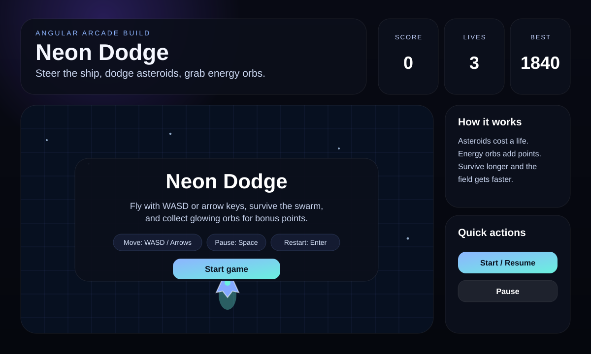
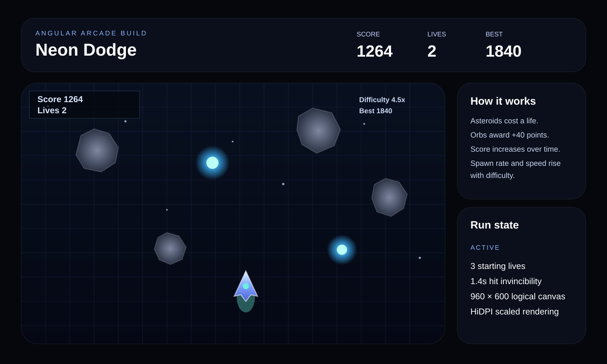
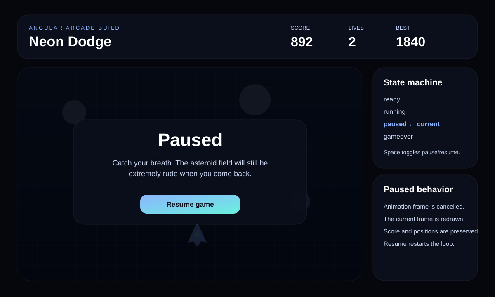
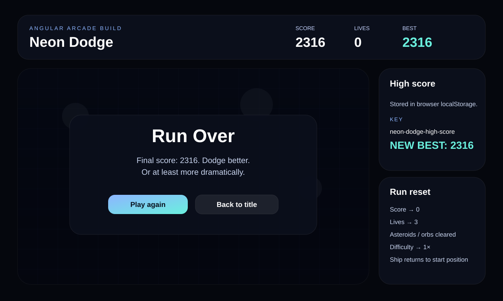

# Neon Dodge

**A browser-based arcade survival game built with Angular 21, TypeScript, Angular Signals, and the HTML Canvas API. Dodge an increasingly hostile asteroid field, collect energy orbs, protect three lives, and chase a persistent high score.**

Neon Dodge is a compact real-time game built directly inside a standalone Angular component. The project combines a `requestAnimationFrame` game loop, responsive HiDPI Canvas rendering, keyboard input, collision detection, procedural spawning, difficulty scaling, temporary hit invulnerability, Angular Signals for UI state, and browser persistence for high scores.

There is no external game engine underneath it. The game simulation and rendering are implemented directly in TypeScript.

> **Run mode:** Neon Dodge currently runs locally as an Angular application. This repository does not currently include a public GitHub Pages deployment workflow.

## Game preview

<p align="center">
  
  &nbsp;
  
</p>

<p align="center">
  <strong>Ready state</strong>: responsive game shell, score/lives/best HUD, controls, and start flow.<br/>
  <strong>Live run</strong>: player ship, falling asteroids, energy orbs, difficulty scaling, and Canvas HUD.
</p>

<p align="center">
  
  &nbsp;
  
</p>

<p align="center">
  <strong>Pause flow</strong>: animation loop suspension with score and game-state preservation.<br/>
  <strong>Game over</strong>: final score, persistent best score, restart, and return-to-title actions.
</p>

> The previews above are **source-faithful documentation visualizations** based directly on the current Angular template, Canvas rendering code, labels, colours, game states, and mechanics. They are not claimed to be captured browser screenshots.

## Project at a glance

| Area | Implementation |
| --- | --- |
| Framework | Angular 21 |
| Language | TypeScript 5.9 |
| Architecture | Standalone Angular component |
| Reactive state | Angular Signals |
| Game rendering | HTML Canvas 2D API |
| Game loop | `requestAnimationFrame` with delta-time updates |
| Input | Keyboard via Angular `HostListener` |
| Collision model | Circle-to-player distance checks |
| Persistence | Browser `localStorage` high score |
| Responsive rendering | Logical 960 × 600 canvas + device-pixel-ratio scaling |
| Styling | Component-scoped CSS |

## Core gameplay loop

```text
Start Run
   |
   v
Move Ship
   |
   +----> Dodge Asteroids
   |          |
   |          +----> Hit -> Lose 1 Life -> Temporary Invincibility
   |
   +----> Collect Energy Orbs -> +40 Score
   |
   v
Survive Longer -> Score Increases
   |
   v
Difficulty Rises
   |
   +----> Faster field movement
   +----> More frequent asteroid spawns
   |
   v
Lives Reach 0
   |
   v
Save New High Score -> Game Over -> Restart
```

The game begins with three lives and a low-pressure asteroid field. As the score climbs, the difficulty multiplier increases, accelerating background motion and entities while reducing the delay between asteroid spawns.

## Controls

| Input | Action |
| --- | --- |
| `WASD` | Move |
| Arrow Keys | Move |
| `Space` | Pause / resume |
| `Enter` | Start or restart |
| On-screen buttons | Start, restart, pause, resume, or return to title |

Diagonal movement is normalized so moving in two directions at once does not make the ship faster than moving horizontally or vertically.

## Game states

The application uses four explicit states:

```text
ready
  |
  v
running <----> paused
  |
  v
gameover
```

### Ready

The game is initialized, the Canvas is rendered, and the start overlay explains the controls.

### Running

The animation loop updates player movement, stars, asteroids, orbs, spawning, collisions, score, and difficulty before rendering the next frame.

### Paused

Pausing cancels the current animation frame and draws the paused overlay without resetting the active run. Resuming restarts the animation loop from the existing state.

### Game over

When lives reach zero, the active frame loop stops. If the current score beats the saved best score, the new value is persisted to `localStorage` before the replay options are shown.

## Player movement

The ship moves freely across the 960 × 600 logical playfield using keyboard input.

The movement system includes:

- WASD and arrow-key support
- Delta-time-based movement
- Normalized diagonal input
- Canvas-boundary clamping
- A player speed of 360 logical units per second
- Movement reset between runs

Angular `HostListener` handles key-down and key-up events at the window level so input remains independent of individual page controls.

## Asteroid system

Asteroids are generated procedurally rather than from image assets.

Each asteroid receives randomized values for:

- Position
- Radius
- Falling speed
- Rotation
- Rotation speed
- Eight-point irregular shape data

The Canvas renderer builds each asteroid from those shape values, fills it with a radial grey gradient, adds a subtle outline, and rotates it independently as it falls.

### Collision behavior

A collision costs one life and removes the asteroid that hit the ship.

After a hit, the player receives approximately **1.4 seconds of invulnerability**. The ship flickers during this period to communicate that state visually and prevent several overlapping asteroids from instantly removing all remaining lives.

## Energy orbs

Energy orbs create a risk/reward objective inside the survival loop.

Each orb:

- Falls through the arena
- Pulses visually using time-based Canvas animation
- Uses layered cyan/blue glow rendering
- Awards **40 points** when collected
- Is removed immediately after collection

Orb spawning also scales with difficulty, although it retains a minimum interval so collectibles do not flood the field.

## Difficulty scaling

Difficulty is derived directly from score:

```ts
difficulty = 1 + Math.min(score / 250, 4.5)
```

That means the game begins at **1× difficulty** and eventually caps at **5.5×**.

The multiplier influences:

- Starfield movement
- Asteroid movement
- Orb movement
- Asteroid spawn frequency
- Orb spawn timing

The asteroid interval is clamped so increasing difficulty never pushes spawning below the configured minimum delay.

## Score system

Score comes from two sources:

1. **Survival time** continuously increases the score while a run is active.
2. **Energy orbs** add 40 bonus points each.

This gives the player two competing goals: avoid danger for as long as possible while deliberately moving toward collectibles for faster scoring.

## Rendering pipeline

The frame renderer draws the arena in a fixed order:

```text
Background gradient
      |
      v
Neon grid
      |
      v
Scrolling stars
      |
      v
Energy orbs
      |
      v
Asteroids
      |
      v
Player ship
      |
      v
Canvas status HUD
```

### Visual system

The game uses a dark navy/black space palette with cool neon accents:

- Deep navy Canvas gradient
- Blue-purple grid lines
- Pale blue starfield
- Grey procedural asteroids
- Cyan/blue pulsing energy orbs
- Blue-violet player ship
- Aqua engine glow
- Glass-like interface panels surrounding the Canvas

The outer Angular interface uses radial gradients, translucent cards, rounded panels, blur effects, and blue/aqua call-to-action styling to match the game itself.

## HiDPI Canvas rendering

The visible game maintains a logical resolution of:

```text
960 × 600
```

The backing Canvas is resized using `window.devicePixelRatio`, then the drawing context is transformed back to logical coordinates.

```text
Logical game coordinates
         |
         v
Multiply backing store by DPR
         |
         v
Scale Canvas context
         |
         v
Sharper rendering on HiDPI displays
```

The CSS Canvas remains responsive while the game logic can continue working in one predictable coordinate system.

## Angular architecture

The primary game is implemented as a standalone `AppComponent`.

```text
bootstrapApplication(AppComponent)
             |
             v
        AppComponent
             |
             +-- Angular Signals
             |     +-- score
             |     +-- lives
             |     +-- highScore
             |     +-- state
             |
             +-- Keyboard HostListeners
             |
             +-- requestAnimationFrame loop
             |
             +-- Canvas update/render methods
             |
             +-- localStorage persistence
```

Angular Signals keep the surrounding DOM HUD synchronized with the Canvas simulation without manually querying or updating page elements.

## Browser persistence

The high score is stored using:

```text
neon-dodge-high-score
```

The read/write helpers guard against environments where `localStorage` does not exist, which keeps the code safe when Angular's server-side tooling evaluates the application outside a browser.

Only the best score is persisted. Individual runs, settings, and player movement are not stored.

## Responsive interface

The game shell adapts around the fixed logical Canvas rather than changing game coordinates for every viewport.

Responsive behavior includes:

- Canvas width scales to the available container
- Desktop two-column game/control layout collapses to one column below 980px
- Top statistics remain in a three-card row until smaller mobile widths
- Stat cards stack below 640px
- Buttons and overlays remain usable without requiring precise mouse interaction
- Canvas preserves a 16:10 aspect ratio

## Tech stack

```text
Angular 21.2
TypeScript 5.9
Angular Signals
HTML Canvas 2D API
RxJS
Angular SSR tooling
Vitest / jsdom tooling
CSS
localStorage
```

## Run locally

This repository is already a complete Angular project. You do **not** need to create a second Angular application and copy these files into it.

Requirements:

- A current Node.js version compatible with Angular 21
- npm

Clone the repository:

```bash
git clone https://github.com/Kyla-Zeit/angular-neon-dodge.git
cd angular-neon-dodge
```

Install dependencies:

```bash
npm install
```

Start the development server:

```bash
npm start
```

Then open the local URL shown by Angular, normally:

```text
http://localhost:4200
```

## Build

Create a production build with:

```bash
npm run build
```

The current Angular workspace uses the application builder with browser and server entry points and is configured with `outputMode: "server"`.

## Project structure

```text
angular-neon-dodge/
├── docs/
│   └── assets/                     # README portfolio previews
├── public/
├── src/
│   ├── app/
│   │   ├── app.component.ts        # Active standalone game component
│   │   ├── app.config.ts
│   │   ├── app.config.server.ts
│   │   ├── app.routes.ts
│   │   └── app.routes.server.ts
│   ├── main.ts                     # Browser bootstrap
│   ├── main.server.ts
│   ├── server.ts
│   ├── index.html
│   └── styles.css
├── angular.json
├── package.json
└── README.md
```

## Scope

Neon Dodge is a portfolio-scale browser arcade game focused on real-time TypeScript logic, Canvas rendering, Angular state management, responsive UI, procedural objects, collision handling, and local browser persistence.

It does not currently include audio, touch controls, online leaderboards, multiplayer, account persistence, a backend game service, or a public deployment workflow.

Potential extensions include mobile touch controls, difficulty modes, audio/music, particle effects, achievements, additional collectible types, online scoreboards, and a static deployment configuration.